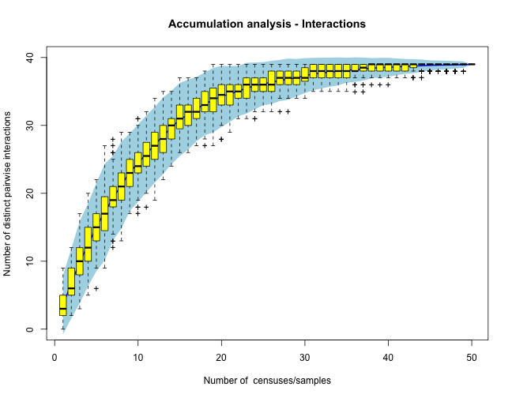

interaccum: Sampling interactions in ecological networks
==========
[](http://dx.doi.org/10.1101/025734)

This is the page for the interactions accumulation analysis project. Here I explore how to detemine sampling robustness for interaction networks by analogy with sampling species diversity.

The repo is for a new MS on sampling plant-animal interaction networks:
Jordano, P. (2016). Sampling networks of ecological interactions. Functional Ecology 00: 000-000. This MS is now in pre-submission review. Hopefully it will see the light as an invited contribution to the Extended Spotlight "From species traits to network structure" coordinated by D. Stouffer, T. Poisot and S. Kefi.

Interactions in natural ecosystems can be a much better indicator of the richness and diversity of ecosystem functions than a simple list of taxa. Thus, sampling interactions should be a central issue when identifying and diagnosing ecosystem services (e.g., pollination, natural seeding by frugivores, etc.). This is a primer on assessing the completeness of sampling for ecological networks. I focus specifically on bipartite, plant-animal interactions, such as those between fleshy-fruited plants and the mutualistic animal frugivores that disperse their seeds.

The goal of sampling interactions is to get a robust representation of the interaction matrix, which describes how the two sets of species (plants and animals) interact. Usually these interaction matrices are taken as adjacency or incidence matrices for analyses of network properties. It is thus crucial to get a robust representation of the adjacency matrix, i.e., a description of the pattern of interactions which is robust to additional sampling: more samples will not dramatically alter the interaction pattern we have described. 

The process I outline here represents a new approach where interactions are explicitly treated as species. Thus, when we record interactions in the field we actually record the presence/absence (or the relative abundance) of "tetranomial" species: for example, we represent a record of *Turdus ilacus* feeding on *Crataegus monogyna* as `TILI - CMON 1` or, if we quantify the number of visits recorded to the plant or the number of fruits consumed, `TILI - CMON 6`.

### Two classical approaches
Let me first illustrate the approach with two examples. First we assess the species richness of a frugivore assemblage visiting *Cecropia glaziouvi* trees in SE Brazil. I call this a "phytocentric" approach, as we focus on plants to get records of the interactions with animals- this is the usual approach in the study of plant-animal interaction networks, by the way. We sampled individual trees so that we can "capture" the range of ecological conditions where trees interact with frugivores. Additional trees mean added sampling effort, so we determine whether or not we get an adequate representation of the frugivore assemblage with just the trees we had sampled. 

The second example illustrates what I call a "zoocentric" approach. I assess the diversity of fruit species consumed by several *Sylvia* warbler species in MEditerranean SW Spain (using my venerable Hato Ratón dataset from my PhD!). I use fecal samples of the birds, obtained during mist-netting, to determine the plant species these warblers interact with. We use bird samples to record the interactions. 

### A new approach focusing explicitly on interactions
Finally I assess the sampling of interactions within diversified networks. This is a novel approach where we simply list the pairwise interactions that we can potentially record in our study network. Then for each sampling day or census we get a vector representing the recorded pairwise interactions, such as e.g., `TILI - CMON 1`. After completing the sampling program what we get is a matrix of pairwise interactions (as rows) and sampling sessions (or censuses), as columns. We use this dataset to analyze the accumulation of distinct pairwise interactions recorded as we increase sampling effort, in an analogous way as we do when analyzing diversity patterns with accumulation curves and rarefaction analysis.

`head(MM[,1:8])`

```r

##   Pairwise sample sample.1 sample.2 sample.3 sample.4 sample.5 sample.6
## 1  A1 - P1      1        1        0        0        0        0        0
## 2  A1 - P2      0        0        0        0        0        1        0
## 3  A1 - P3      0        0        0        0        0        0        0
## 4  A1 - P4      1        0        0        0        0        0        0
## 5  A1 - P5      1        0        0        0        0        0        1
## 6  A1 - P6      0        1        0        0        0        0        0

```



Note that this approach subtly differs from recent analysis of sampling completeness for networks (see References) that use the traditional approach. My point is that by focusing on interactions we actually incorporate the actual protocols we use during field work and we get a truly "network level" assessment of sampling robustness.

I prefer this later approach, as it recognizes interactions as a proper component of biodiversity. It also reflects the way we proceed in the field: we do sample interactions, i.e., records of animals we see doing things on plants. We don't census individuals to record species (as we do in traditional diversity inventories); we census and record the interactions themselves. The beauty of the approach is that it uses exactly the same protocols used in the traditional inventories of species diversity. It also shows that the analysis of complex ecological interaction networks has exactly the same limitations, potential biases, and effort tradeoffs as the traditional analysis of diversity patterns.


### References

1. Jordano, P. (1987). Patterns of mutualistic interactions in pollination and seed dispersal: connectance, dependence asymmetries, and coevolution. *Amer Nat*, **129**, 657–677.

2. Olesen, J.M., Bascompte, J., Dupont, Y.L., Elberling, H. & Jordano, P. (2011). Missing and forbidden links in mutualistic networks. *Proc R Soc B*, **278**, 725–732.

3. Chacoff, N.P., Vazquez, D.P., Lomascolo, S.B., Stevani, E.L., Dorado, J. & Padrón, B. (2012). Evaluating sampling completeness in a desert plant-pollinator network. *J Anim Ecol*, **81**, 190–200.

4. Rivera-Hutinel, A., Bustamante, R.O., Marín, V.H. & Medel, R. (2012). Effects of sampling completeness on the structure of plant-pollinator networks. *Ecology*, **93**, 1593–1603.

5. Gibson, R.H., Knott, B., Eberlein, T. & Memmott, J. (2011). Sampling method influences the structure of plant–pollinator networks. *Oikos*, **120**, 822–831.

6. Bosch, J., Martín González, A.M., Rodrigo, A. & Navarro, D. (2009). Plant-pollinator networks: adding the pollinator’s perspective. *Ecol Lett*, **12**, 409–419.

7. Gotelli, N. & Colwell, R. (2001). Quantifying biodiversity: procedures and pitfalls in the measurement and comparison of species richness. *Ecol Lett*, **4**, 379–391.

8. Chao, A., Colwell, R.K., Lin, C.-W. & Gotelli, N.J. (2009). Sufficient sampling for asymptotic minimum species richness estimators. *Ecology*, **90**, 1125–1133.


A detailed descripton of the code is in my [git pages](http://pedroj.github.io/interaccum/).

